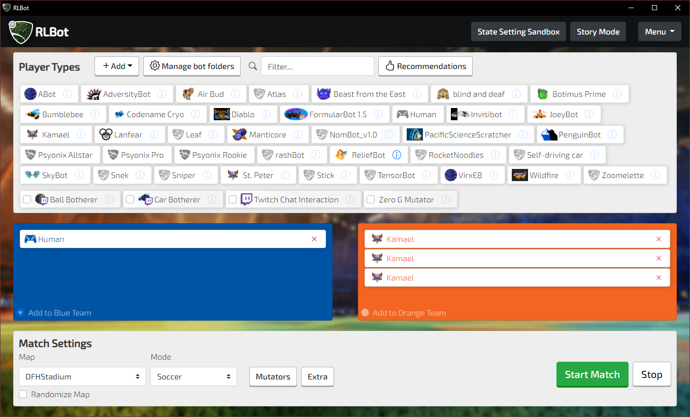

# RLBotGUI

## About

RLBotGUI is a streamlined user interface that helps you run custom
Rocket League bots for offline entertainment. It relies on the RLBot
project to work its magic: https://github.com/RLBot/RLBot

Works on Windows and Linux

## Features

- Download various bots programmed by the community
- Get started with creating your own bot
- Create matches against bots
  - Customize game mode, arena and mutators!
- Try out the Story Mode

## Screenshots

You can download, update or create bots

In Story Mode, you can take over cities by beating challenges and can also
recruit teammates and purchase upgrades for your car!

## Installation

If you just want to use this GUI, you can go download the installer from http://www.rlbot.org/

It will put "RLBotGUI" in your Windows start menu.

## Dev Environment Setup

### Prerequisites

- Python 3.7

### Setup

1. In a command prompt, run `pip install -r requirements.txt`
2. Run `python run.py`

### Deployment to PyPI

For normal changes, e.g. things happening inside the rlbot_gui folder,
you should be publishing an update to PyPI. All users will get this change
automatically without needing to reinstall!

To deploy:
1. Create a .pypirc file like the one described here:
https://github.com/RLBot/RLBot/wiki/Deploying-Changes#first-time-setup
1. Look in setup.py and increment the version number.
1. Run `publish-to-pypi-prod.bat`

#### Note
When deploying to pypi, the files which get included are controlled by the MANIFEST.in file.
You may wish to exclude anything which does not belong in the initial install, e.g.
bot logos which get copied in to the GUI folder as you use the program.

As a rule of thumb, if you add something to .gitignore, it may also belong in MANIFEST.in
as a prune line.

### Building the Installer

You can build an installer executable for users to download. You will rarely need
to do this, because normal updates should be pushed to users by deploying to PyPI.

You really only need a new installer if you changed something in the pynsist_helpers
folder, run.py, or anything else that gets referenced in installer.cfg. **AVOID THIS**
because you don't want to run around bugging users to reinstall.

1. Follow https://pynsist.readthedocs.io/en/latest/index.html to get NSIS installed.
2. Run `pip install pynsist`
3. Run `pynsist installer.cfg`

Find the resulting executable in build\nsis.

### How to update items in the appearance editor
1. Install and run [BakkesMod](http://www.bakkesmod.com/)
2. In Rocket League, press F6 to open the BakkesMod console, and enter the `dumpitems` command
3. Find the output `items.csv` in the folder where your `RocketLeague.exe` is, usually `C:/Program Files (x86)/Steam/steamapps/common/rocketleague/Binaries/Win64`
4. Replace `rlbot_gui/gui/csv/items.csv` with the new file
5. Change encoding of the new file to UTF-8. Here's how to do that in VS Code:
   - use the _Change File Encoding_ command (or click the UTF-8 button in the bottom right)
   - select _Reopen with Encoding_, select the one with _Guessed from content_
   - now do that again, but _Save with Encoding_ and _UTF-8_
6. Don't forget to bump the version number in `setup.py`
